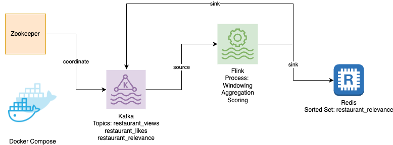
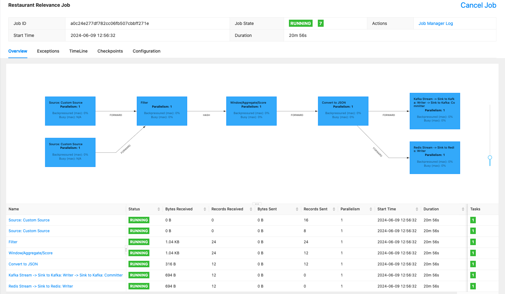

# Real-Time Restaurant Relevance Calculator

This project calculates the relevance of restaurants in real time based on views and likes.
This information is useful for applications that need to know which restaurants are currently trending.

It uses:
* **Kafka**, a distributed and highly scalable event streaming platform, to ingest the data.
* **Flink**, a framework and distributed processing engine for stateful computations over unbounded and bounded data streams, to process the data.
* **Zookeeper**, a centralised service for maintaining configuration information, naming, providing distributed synchronisation, and providing group services.
* **Docker** and **Docker Compose** to deploy the services required by the project.
* **Redis**, an in-memory data store, used as a cache to store the restaurant relevance data.

## System Design and Architecture
This system is designed to be scalable and handle high velocity data streams. It leverages state-of-the-art streaming technology: Kafka for data ingestion, Flink for data processing, and Redis to cache a sorted set of trending restaurants.
It dynamically updates every 30 seconds based on relevance scores calculated by the Flink job, providing real-time information about trending restaurants.

The more traffic is expected, the lower the window size should be to provide more up-to-date information (windows are currently set to a very short duration for demonstration purposes).

### System Components


### Data Processing Flow


## Getting Started

These instructions will get you a copy of the project up and running on your local machine for development and testing purposes.

### Prerequisites

- Java 8 or higher
- Gradle
- Docker

## Deploying the infrastructure

The project uses Docker for easy deployment. The `docker-compose.yml` file contains the configuration for the services required by the project, including Zookeeper, Kafka, Redis, and Flink's JobManager and TaskManager.

To deploy the project, run `docker-compose up` in the project directory.

## Creating the Kafka topics
Run the following commands to create the Kafka topics required by the project:
```bash
docker-compose exec kafka kafka-topics --create --topic restaurant_views --partitions 1 --replication-factor 1 --bootstrap-server kafka:9092

docker-compose exec kafka kafka-topics --create --topic restaurant_likes --partitions 1 --replication-factor 1 --bootstrap-server kafka:9092

docker-compose exec kafka kafka-topics --create --topic restaurant_relevance --partitions 1 --replication-factor 1 --bootstrap-server kafka:9092
```    

## Flink Job

### Building the Flink job
1. Clone the repository to your local machine.
2. Navigate to the flink-jobs directory.
3. Run `./gradlew clean shadowJar` to build the project.

### Running the Flink job
1. Navigate to the Flink dashboard at http://localhost:8081
2. Click on "Submit new job" and upload the JAR file located in the `flink-jobs/build/libs` directory
3. Click on "Submit" to start the job.

## Running the tests

The project uses JUnit for testing. Navigate to the flink-jobs directory and run `gradle test` to execute the tests.

## Code Overview

The main class of the project is `RestaurantRelevanceJob`. It sets up a Flink streaming job that reads restaurant view and like events from Kafka, calculates a relevance score for each restaurant, and writes the scores back to Kafka.

The job uses a sliding processing time window of 30 seconds with a slide of 5 seconds to calculate the relevance scores. The scores are calculated by the `RelevanceAggregate` and `RelevanceScoringFunction` classes.

The `RestaurantEventDeserializationSchema` class is a schema used to deserialise the Kafka messages into `RestaurantEvent` objects.

The `createKafkaSink` method creates a Kafka sink that writes the relevance scores back to Kafka.

## Redis

The Python script `print_relevance_scores.py` is used to print the relevance scores of restaurants in descending order. It connects to Redis and retrieves the sorted set data.

Before running the script, make sure you have Python installed on your machine and the required Python packages are installed. You can install the latter using the `requirements.txt` file in the `python` directory:

```bash
pip install -r python/requirements.txt
```

## Interacting with the Redis CLI
Alternatively, you can interact with Redis using the Redis CLI. To do this, you need to connect to the Redis container.
From within the Redis container, run:

```bash
redis-cli
```
List all restaurants and their relevance scores:

```bash
ZRANGE restaurant_relevance 0 -1 WITHSCORES
```

As interactions (views and likes) increase or decrease, the relevance score is adjusted, indicating an increase or decrease in current interest.

## Kafka

### Creating producers using the console:
#### Restaurant Views
```bash
docker exec -it {container id} kafka-console-producer --broker-list localhost:9092 --topic restaurant_views
```
#### Restaurant Likes
```bash
docker exec -it {container id} kafka-console-producer --broker-list localhost:9092 --topic restaurant_likes
```
### Produce data:

```
{"restaurantId": "1", "eventType": "view", "timestamp": "2024-06-07T15:55:00Z"}
{"restaurantId": "1", "eventType": "like", "timestamp": "2024-06-07T15:55:00Z"}
```

### Creating consumer using the console:

```bash
docker exec -it {container id} kafka-console-consumer --bootstrap-server localhost:9092 --topic restaurant_relevance --from-beginning
```

### Listing topics:

```bash
docker-compose exec kafka kafka-topics --list --bootstrap-server kafka:9092
```

## Authors

- [Thalita Vergilio](https://github.com/tvergilio)

## License

This project is licensed under the MIT License - see the [LICENSE.md](LICENSE.md) file for details.

