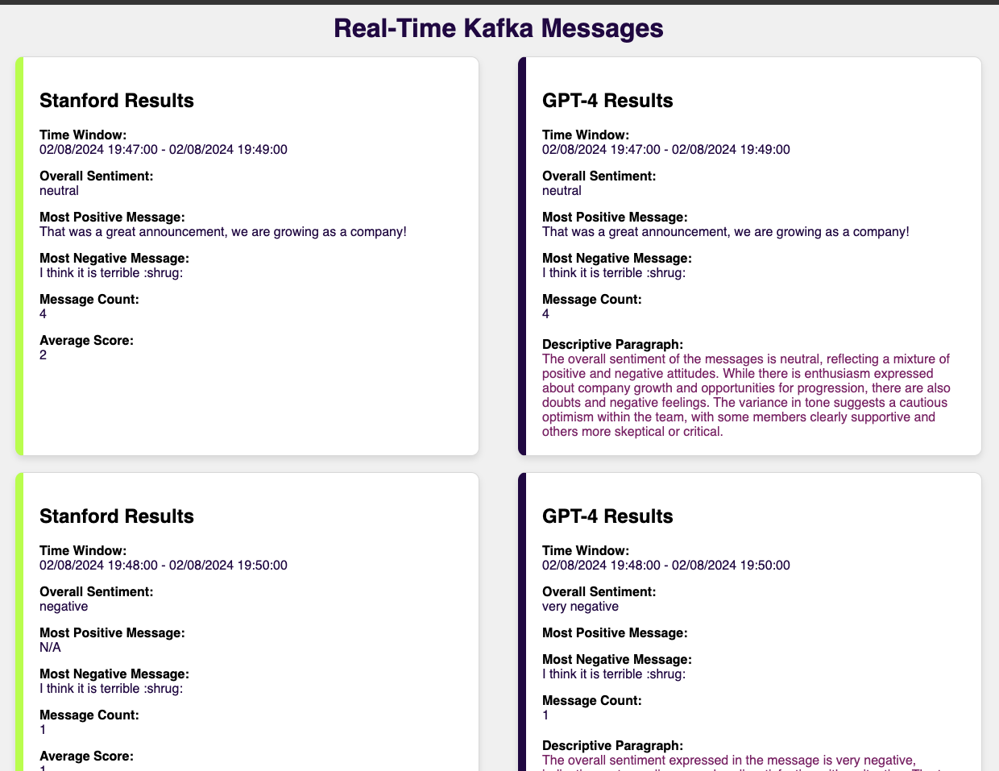

# Real-Time Sentiment Analysis

This project sets up a real-time sentiment analysis pipeline for processing messages from Slack. The implementation focuses on establishing the Kafka infrastructure, defining the data flow, integrating Slack to stream messages into Kafka, performing sentiment analysis using the Stanford CoreNLP library, and leveraging GPT-4 for advanced sentiment analysis.

It uses:
* **Kafka**: A distributed and highly scalable event streaming platform for ingesting data.
* **Flink**: A framework and distributed processing engine for stateful computations over unbounded and bounded data streams, to process the data.
* **Stanford CoreNLP**: A suite of natural language processing tools for performing sentiment analysis.
* **GPT-4**: Enhances sentiment analysis with advanced natural language understanding, providing detailed sentiment summaries.
* **Docker** and **Docker Compose**: To deploy the services required by the project.
* **WebSocket and Express (Node.js)**: To create a real-time frontend that displays the sentiment analysis results.

## System Design and Architecture

This system is designed to be scalable and handle high-velocity data streams. It leverages Kafka for data ingestion and Flink for data processing.

### System Components

1. **Slack Integration**: Streams messages from Slack into Kafka.
2. **Flink Job**: Processes messages for sentiment analysis using Stanford CoreNLP and GPT-4.
3. **WebSocket Server**: Streams processed sentiment analysis results to the frontend in real time.
4. **Frontend**: Displays sentiment analysis results in real-time.

### Data Processing Flow


## Setting Up and Running the Project

### Prerequisites

- Docker and Docker Compose installed on your machine.

### Clone the Repository

```bash
git clone https://github.com/tvergilio/real-time-infrastructure.git
cd real-time-infrastructure
```

### Environment Configuration

1. **Configure Slack and GPT-4**: Update the `.env` file with your Slack API token, channel ID, and OpenAI API key.

   ```
   SLACK_API_TOKEN=your-slack-api-token
   SLACK_CHANNEL_ID=your-slack-channel-id
   OPENAI_API_KEY=your-openai-api-key
   ```

### Deploy the Infrastructure

1. **Build and Run the Docker Containers**:

   ```bash
   docker-compose up --build
   ```

   This command will start the entire stack, including Zookeeper, Kafka, Flink, Redis, Slack Producer, and the WebSocket Consumer.

### Creating Kafka Topics

Run the following commands to create the Kafka topics required by the project:

```bash
docker-compose exec kafka kafka-topics --create --topic slack_messages --partitions 1 --replication-factor 1 --bootstrap-server kafka:9092

docker-compose exec kafka kafka-topics --create --topic stanford_results --partitions 1 --replication-factor 1 --bootstrap-server kafka:9092

docker-compose exec kafka kafka-topics --create --topic gpt4_results --partitions 1 --replication-factor 1 --bootstrap-server kafka:9092
```

### Access the Real-Time Frontend

1. **Open the Frontend**: Open a web browser and navigate to `http://localhost:8080`. This will display the real-time sentiment analysis results as they are streamed from the WebSocket server.



## Example Results if Reading Directly from Kafka

### Stanford CoreNLP Sentiment Analysis

```plaintext
SentimentAccumulator{start=2024-07-31T15:18:30, end=2024-07-31T15:19:30, averageScore=2.83, result='Positive', mostPositiveMessage='That was amazing!', mostNegativeMessage='Average, I think. I have seen better.', messageCount=5}
```

### GPT-4 Enhanced Sentiment Analysis

```plaintext
**Time Window:** 2024-07-31T15:18:30 - 2024-07-31T15:19:30  
**Summary of Sentiment:**
- **Overall Sentiment:** Positive  
- **Most Positive Message:** "That was amazing!"  
- **Most Negative Message:** "Average, I think. I have seen better."
- **Message Count:** 5  
The overall sentiment of the messages processed during the time window is neutral. The tone of the messages indicates that the users found their experiences to be mediocre, with phrases highlighting that things were "ok," "fine," and "average," suggesting an absence of strong emotion or enthusiasm. While there isn't outright negativity, the language used hints at a sense of disappointment or lack of fulfillment, implying that they expected something better. 
```

## Running the Tests

The project uses JUnit for testing. Navigate to the `flink-jobs` directory and run:

```bash
./gradlew test
```

This will execute the unit tests to ensure everything is functioning correctly.

## Authors

- [Thalita Vergilio](https://github.com/tvergilio)

## License

This project is licensed under the MIT License - see the [LICENSE.md](LICENSE.md) file for details.

---
