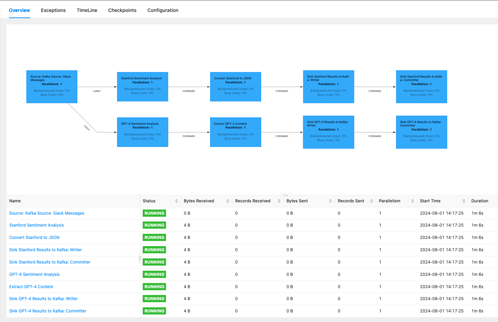

# Real-Time Sentiment Analysis

This project sets up a real-time sentiment analysis pipeline for processing messages from Slack. The initial implementation focuses on setting up the Kafka infrastructure, defining the pipeline's data flow, integrating Slack to stream messages into Kafka, and performing sentiment analysis using the Stanford CoreNLP library.

It uses:
* **Kafka**, a distributed and highly scalable event streaming platform, to ingest the data.
* **Flink**, a framework and distributed processing engine for stateful computations over unbounded and bounded data streams, to process the data.
* **Stanford CoreNLP**, a suite of natural language processing tools, for performing sentiment analysis.
* **Docker** and **Docker Compose** to deploy the services required by the project.

## System Design and Architecture
This system is designed to be scalable and handle high-velocity data streams. It leverages state-of-the-art streaming technology: Kafka for data ingestion and Flink for data processing.

### System Components
TODO

### Data Processing Flow


## Slack Integration

### Overview

The Slack integration subproject is responsible for connecting to a specified Slack channel, streaming messages from that channel, and publishing them to a Kafka topic. This component ensures that messages from Slack are ingested into the Kafka pipeline for further processing.

### Structure

- **SlackConnector**: Connects to Slack using the Slack API and streams messages from a specified channel.
- **KafkaProducer**: Produces messages to the Kafka topic `slack_messages`.
- **Configuration**: Contains necessary configurations for connecting to Slack and Kafka.

### Setting Up Slack Integration

1. **Clone the Repository**: Clone the `real-time-infrastructure` repository to your local machine.

   ```bash
   git clone https://github.com/tvergilio/real-time-infrastructure.git
   ```

2. **Navigate to the Slack Integration Directory**:

   ```bash
   cd real-time-infrastructure/slack-integration
   ```

3. **Install Dependencies**: Install the required dependencies for the Slack integration project.

   ```bash
   pip install -r requirements.txt
   ```

4. **Configure Slack and Kafka**: Update the `.env` file with your Slack API token and the channel ID you want to monitor.

   ```
   SLACK_API_TOKEN=your-slack-api-token
   SLACK_CHANNEL_ID=your-slack-channel-id
   ```

5. **Run the Slack Integration**:

   ```bash
   python slack_connector.py
   ```

This will start the Slack connector, which listens to messages in the specified Slack channel and streams them to the `slack_messages` Kafka topic.

## Getting Started

These instructions will get you a copy of the project up and running on your local machine for development and testing purposes.

### Prerequisites

- Java 8 or higher
- Gradle
- Docker

## Deploying the Infrastructure

The project uses Docker for easy deployment. The `docker-compose.yml` file contains the configuration for the services required by the project, including Zookeeper, Kafka, and Flink's JobManager and TaskManager.

To deploy the project, run `docker-compose up` in the project directory.

## Creating the Kafka Topics
Run the following commands to create the Kafka topics required by the project:
```bash
docker-compose exec kafka kafka-topics --create --topic slack_messages --partitions 1 --replication-factor 1 --bootstrap-server kafka:9092

docker-compose exec kafka kafka-topics --create --topic stanford_results --partitions 1 --replication-factor 1 --bootstrap-server kafka:9092

docker-compose exec kafka kafka-topics --create --topic gpt4_results --partitions 1 --replication-factor 1 --bootstrap-server kafka:9092
```

## Flink Job

### Building the Flink Job
1. Clone the repository to your local machine.
2. Navigate to the flink-jobs directory.
3. Run `./gradlew clean shadowJar` to build the project.

### Running the Flink Job
1. Navigate to the Flink dashboard at http://localhost:8081
2. Click on "Submit new job" and upload the JAR file located in the `flink-jobs/build/libs` directory
3. Click on "Submit" to start the job.

## Running the Tests

The project uses JUnit for testing. Navigate to the flink-jobs directory and run `gradle test` to execute the tests.

## Code Overview

The main class of the project is `SentimentAnalysisJob`. It sets up a Flink streaming job that reads Slack messages from Kafka, performs sentiment analysis using the Stanford CoreNLP library, and writes the results back to Kafka.

The `SentimentAnalysisFunction` class initializes the Stanford CoreNLP pipeline and processes each message to determine its sentiment. The sentiment scores and classes are aggregated, and the most positive and most negative messages within each window are identified.

The `createKafkaSink` method creates a Kafka sink that writes the sentiment analysis results back to Kafka.

### Sample Result
```plaintext
SentimentAccumulator{start=2024-07-30T12:24:30, end=2024-07-30T12:25:30, averageScore=2.14, averageClass=Neutral, messageCount=7, mostPositiveMessage='Amazing!', mostNegativeMessage='Terrible, really really bad'}
```

## Kafka

### Creating Producers Using the Console:
#### Slack Messages
```bash
docker exec -it {container id} kafka-console-producer --broker-list localhost:9092 --topic slack_messages
```

### Producing Data:

```plaintext
Timestamp: 1721903155.837829, User: U07DET2KZ2B, Message: I love this product!
Timestamp: 1721903691.691959, User: U07DET2KZ2B, Message: This is terrible service!
```

### Creating Consumer Using the Console:

```bash
docker exec -it {container id} kafka-console-consumer --bootstrap-server localhost:9092 --topic sentiment_results --from-beginning
```

### Listing Topics:

```bash
docker-compose exec kafka kafka-topics --list --bootstrap-server kafka:9092
```

## Authors

- [Thalita Vergilio](https://github.com/tvergilio)

## License

This project is licensed under the MIT License - see the [LICENSE.md](LICENSE.md) file for details.
```

